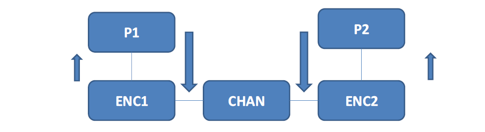

# Interprocess Communication (IPC) in Linux OS


## Development Environment

The code was tested in Linux systems. More specifically, the software used was:
* Ubuntu 18.04.6 LTS
* gcc 7.5.0
* valgrind 3.13.0
* GNU Make 4.1

## Objective
The purpose of this project is to implement an architecture of processes according to which two users can exchange messages as it is shown in the picture below.



* Five processes are available P1, P2, ENC1, ENC2 and CHAN.
Processes P1, P2 accept and present data to the user. The input
to processes P1, P2 is a string which is a message with
the prospect of being sent to the other process (ie P1 → P2 or P2 → P1). If the message is registered by a user in P1, it will go first through processes ENC1, CHAN, ENC2. If the message is valid, then it will be presented to the user of P2. (respectively from P2 to P1).

* Processes ENC1 and ENC2 receive messages from P1, P2 respectively, they calculate the hash value of the given message (checksum) and then send the augmented message (message + checksum) in the CHAN process which simulates the transport network.

* The CHAN process will replace the characters in the message with others randomly based on a probability. 

* If the message-string in its path from P1 to P2 (and vice versa) is corrupted in ENC2 (respectively in ENC1) after the checksum check, it will be rejected (the incoming message). If the message remains unchanged despite the random replacement process, it is presented to the user of P2 (respectively P1).

* If there is a mismatch between string and checksum of the message (e.g. of P1) visible in ENC2, the process ENC2 will request the retransmission of the relevant information.

* If the message "TERM" is sent, then all the processes (P1, P2, ENC1, ENC2, CHAN) are terminated.


### Compilation and running

There is Makefile for the compilation and running of the program:

```
make clean
make all
```
This Makefile directive will produce **p1** and **p2** executables. Then you can type in **two different** terminals:

```
./p1
```
and

```
./p2
```
Then you can send messages between the two processes.